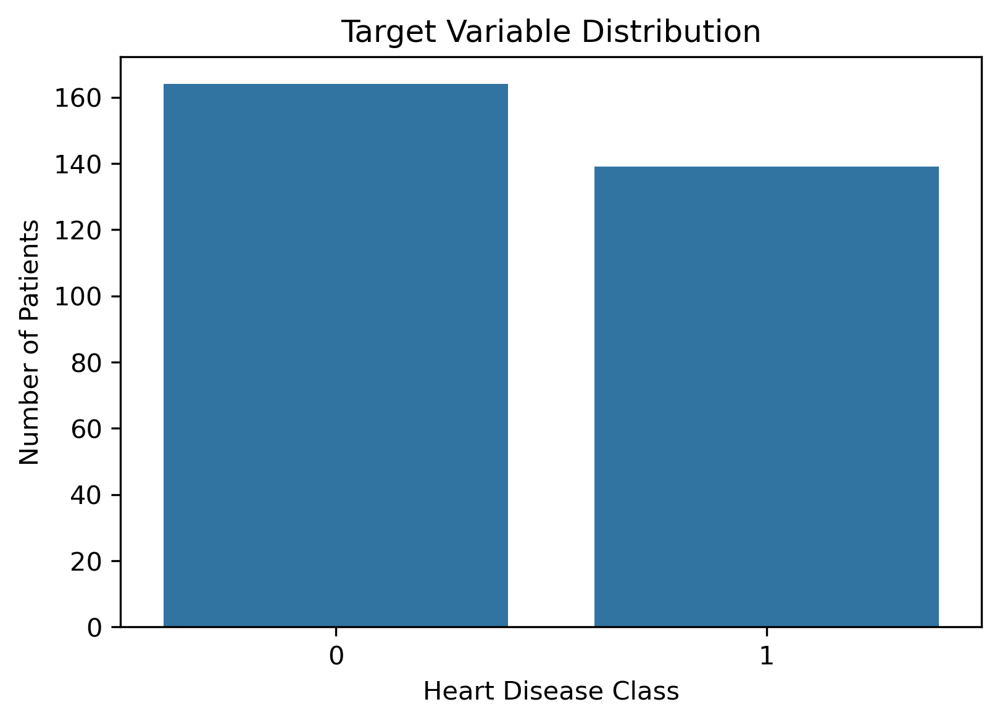
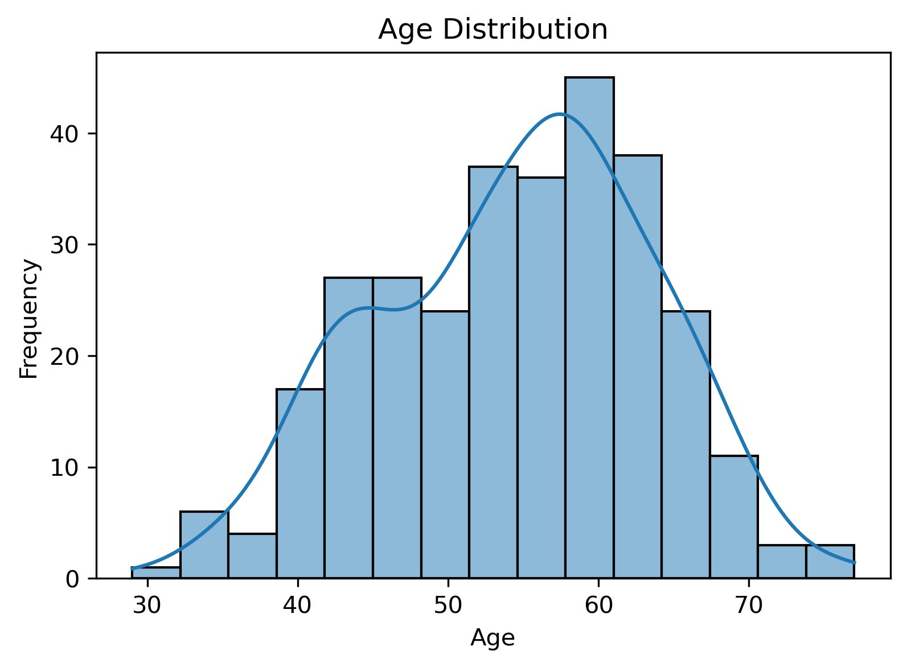
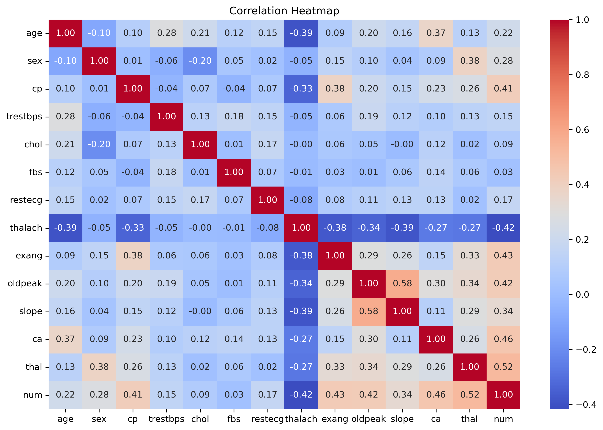
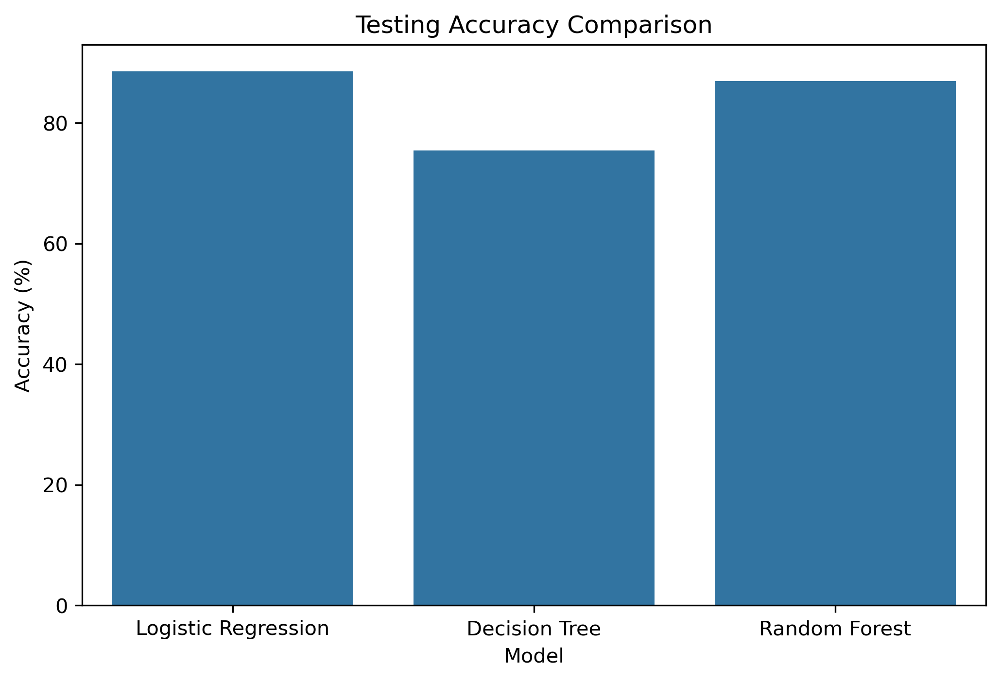
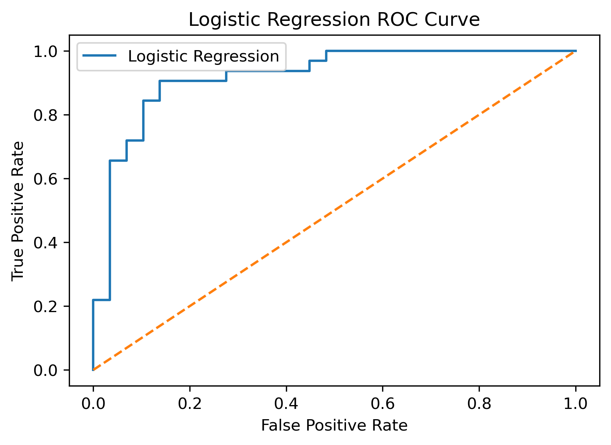
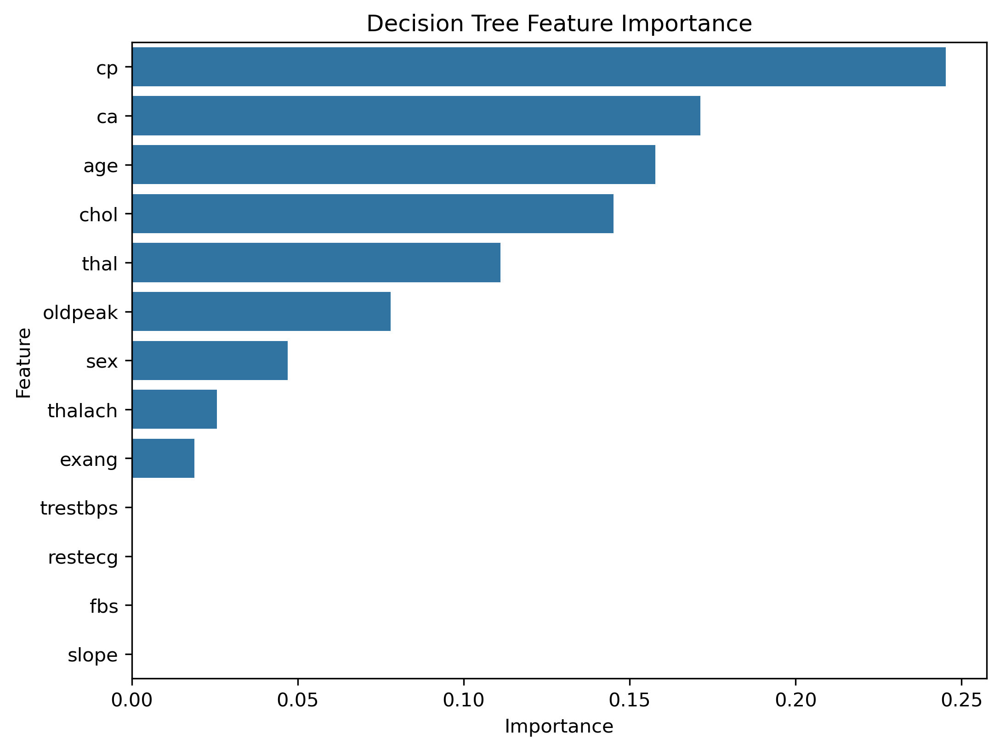

# ❤️ Heart Disease Prediction using Machine Learning

## 📌 Project Overview


This project predicts whether a patient is likely to have heart disease using Machine Learning classification algorithms. The project follows a complete machine learning workflow, including data preprocessing, exploratory data analysis (EDA), feature engineering, model building, evaluation, hyperparameter tuning, cross-validation, feature importance analysis, and prediction on new patient data.

## 🛠️ Technologies Used

- Python
- Pandas
- NumPy
- Matplotlib
- Seaborn
- Scikit-learn
- Joblib
- Jupyter Notebook

## 📂 Dataset Information

- **Dataset Name:** Heart Disease Dataset
- **Source:** UCI Machine Learning Repository
- **Total Records:** 303
- **Total Features:** 13
- **Target Variable:** `num`
  - **0** → No Heart Disease
  - **1** → Heart Disease

## 📊 Exploratory Data Analysis (EDA)

The dataset was explored using different visualization techniques to understand feature distributions, identify relationships among variables, detect potential outliers, and analyze the target variable before model building.

### Target Variable Distribution



### Age Distribution



### Correlation Heatmap




## 🤖 Model Performance

Three machine learning models were trained and evaluated on the dataset.

| Model | Testing Accuracy |
|--------|-----------------:|
| Logistic Regression | 88.52% |
| Decision Tree | 75.41% |
| Random Forest | 86.89% |

### Model Comparison



### ROC Curve (Logistic Regression)




## 📈 Feature Importance

The Random Forest model was used to estimate the importance of each feature. Features with higher importance contribute more to predicting heart disease.




## 📁 Project Structure

```
Heart-Disease-Prediction/
│
├── Images/
│   ├── age_distribution.png
│   ├── correlation_heatmap.png
│   ├── feature_importance.png
│   ├── model_comparison.png
│   ├── roc_curve.png
│   └── target_variable_distribution.png
│
├── Heart Disease Risk Prediction.ipynb
├── Heart disease dataset.csv
├── heart_disease_model.pkl
├── README.md
└── requirements.txt
```


## 🚀 Installation

1. Clone the repository

```bash
git clone https://github.com/your-username/Heart-Disease-Prediction.git
```

2. Move to the project folder

```bash
cd Heart-Disease-Prediction
```

3. Install the required libraries

```bash
pip install -r requirements.txt
```

4. Open the Jupyter Notebook and run all cells.

## 📌 Conclusion

This project demonstrates a complete machine learning workflow for heart disease prediction, starting from data preprocessing and exploratory data analysis to model training, evaluation, hyperparameter tuning, and prediction. Among the evaluated models, Logistic Regression achieved the best performance on the test dataset.

---

## 👨‍💻 Author

**Roshan Kumar**

- M.Sc. Statistics & Computing, Banaras Hindu University (BHU)
- Aspiring Data Analyst
